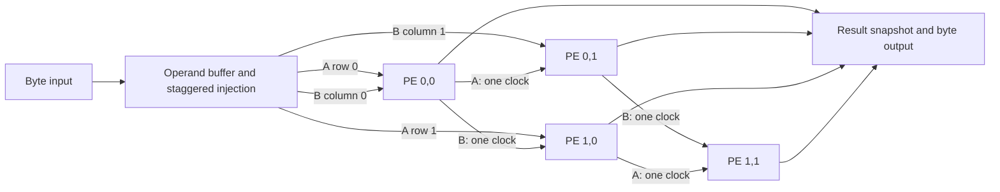

# Parameterized systolic MAC accelerator

A signed, output-stationary matrix multiplier for TinyTapeout SKY130. The default
computes `C[2,2] = A[2,2] @ B[2,2]` with 8-bit operands and 24-bit accumulators.
The TinyTapeout pin interface is retained; the old combinational ALU is replaced.

## Project progression

1. **PE:** `src/mac_pe.v` implements signed multiplication, sign extension,
   wrapping accumulation, operand forwarding, valid bits, clear, and clock enable.
2. **Systolic fabric:** `src/systolic_array.v` connects PEs in `ROWS × COLS` form.
   A moves right and B moves down through registers. Each PE holds one output sum.
3. **Controller and buffers:** `src/mac_accelerator.v` buffers A and B, injects a
   staggered wavefront, drains the fabric, snapshots results, and serializes bytes.
4. **TinyTapeout integration:** `src/project.v` exposes the byte protocol through
   the standard pins. `src/config.vh` selects the default hardware configuration.
5. **Verification:** PE arithmetic, cycle-by-cycle array partial sums, and complete
   transactions are tested independently against Python/NumPy models.
6. **Implementation comparison:** synthesis scripts and selectable GDS workflow
   profiles compare widths, dimensions, physical area, timing, and useful throughput.



## Run locally

Requires Python 3.11+, Icarus Verilog, make, and Yosys for synthesis.

```sh
python3 -m venv .venv
. .venv/bin/activate
pip install -r test/requirements.txt
make -C test                           # default public-pin tests
python3 scripts/regress.py             # all ten configurations, all three stages
python3 scripts/regress.py default     # one configuration
python3 scripts/synth_sweep.py         # five synthesis/throughput configurations
# Optional SKY130 technology mapping:
python3 scripts/synth_sweep.py --liberty /path/to/sky130_fd_sc_hd__tt_025C_1v80.lib
```

Full regression logs and XML results are in `test/sim_build/<configuration>/<stage>`.
Synthesis reports are in `reports/`. Generic cell counts are not physical area;
Liberty-mapped area is the sum of cell areas before placement/routing.

## Configuration and hardware protocol

All dimensions are compile-time parameters: A is `ROWS × K`, B is `K × COLS`.
`DATA_W >= 1`, `ACC_W >= 2*DATA_W`, and all dimensions must be positive.
To guarantee exact sums for every input, use
`ACC_W >= 2*DATA_W + ceil(log2(K))`; narrower legal accumulators wrap modulo
`2**ACC_W`. There is no saturation or bias input.

The complete [datasheet](docs/info.md) covers pins, byte order, commands,
backpressure, stalls, arithmetic, and a worked example. The default tile allocation is 2×2, with a 25 ns (40 MHz) clock target.
See the measured physical results below for closure and remaining warnings.

## GitHub Actions and physical comparisons

The existing `ttsky26a` TinyTapeout GDS, precheck, gate-level test, documentation,
and optional FPGA workflows are retained. This template uses
[LibreLane](https://github.com/TinyTapeout/tt-gds-action), the current successor
used by the TinyTapeout pipeline. The test workflow runs the full parameter
regression, Verilator lint, and a generic synthesis comparison.

The **gds** workflow has a manual `configuration` choice: `tiny`, `small`,
`default`, `wide_acc`, or `rectangular`. Launch one run per configuration; the
standard action's artifact names are fixed, so these are separate workflow runs.
Each run selects matching RTL defaults, tile count, and gate-level test parameters.
A normal push builds `default`. The smaller and larger footprints are initial
allocations, not promises of timing closure or manufacturability.

For local hardening, follow the official
[TinyTapeout setup guide](https://www.tinytapeout.com/guides/local-hardening/),
then run from this checkout:

```sh
python3 scripts/select_config.py default # modifies config.vh and info.yaml
python tt/tt_tool.py --create-user-config
python tt/tt_tool.py --harden
python tt/tt_tool.py --print-stats
```

For a native LibreLane installation with its EDA tools on PATH, the local sweep
uses isolated run directories and the same official floorplan templates:

```sh
python3 scripts/physical_sweep.py default small wide_acc --pdk-root /path/to/pdk-root
```

It requires the `tt` support-tools checkout and a PDK root containing `sky130A`.
Use `--period 25` to select the timing target; results and run logs are retained.
For another iteration at the same width/clock, use a fresh suffix such as `--tag r2`.

Record the exact tools/PDK, cell area, worst setup/hold slack, clock period, DRC/LVS,
and transaction throughput for each run. Change the clock target consistently in
`src/config.json` and `info.yaml` when exploring timing. See
[measured synthesis results](reports/synthesis.md), [physical results](reports/physical.md),
and [verification results](reports/verification.md).
